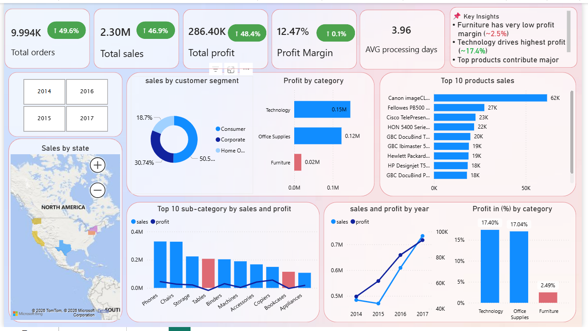

# Superstore Sales Analysis and Forecasting

## Project Overview

This project analyzes sales data from a global retail superstore to understand sales performance across products, regions, and customer segments.

The objective of this project is to demonstrate a complete **end-to-end data analytics workflow**, including:

- Data preparation
- SQL-based data analysis
- Exploratory data analysis (EDA)
- Interactive dashboard development

The project uses **Excel, PostgreSQL (SQL), and Power BI** to transform raw data into actionable business insights.

---

# Business Problem

Retail organizations need to understand historical sales performance in order to:

- Identify high-performing products
- Evaluate regional market performance
- Understand customer purchasing behavior
- Anticipate future demand

This project aims to answer the following business questions:

1. Which **product categories generate the most sales**?
2. Which **regions contribute the highest revenue**?
3. Which **products drive the highest sales**?
4. What are the **sales trends over time**?

---

# Dataset

The dataset used in this project is the **Superstore Sales Dataset**, which contains four years of retail transaction data including:

- Product information
- Customer segments
- Geographic regions
- Order and shipping dates
- Sales values


Dataset details and download instructions can be found here:

Link of the dataset "data/superstore_dataset.csv"

---

# Tools and Technologies

The project uses the following tools:

| Tool | Purpose |
|-----|--------|
| **Excel** | Initial data inspection and validation |
| **PostgreSQL / SQL** | Data storage and analytical queries |
| **Power BI** | Dashboard development and sales forecasting |

---

# Project Workflow

The analysis follows a structured data analytics workflow.

---

## 1. Data Preparation

The dataset was inspected and validated to ensure accuracy and consistency.

Key steps included:

- Data inspection in Excel
- Column data type validation
- Duplicate record checks
- Missing value verification
- Importing the dataset into PostgreSQL

---

## 2. SQL Analysis

SQL queries were used to analyze business performance and generate key metrics including:

- Overall sales KPIs
- Product performance analysis
- Regional sales comparisons
- Customer segment analysis
- Time-series sales trends
- Shipping performance evaluation

SQL scripts are included in:

`sql/Queries.sql`

---

## 3. Dashboard Development

A Power BI dashboard was created to visualize key metrics and insights through interactive visualizations.

The dashboard includes:

- Sales performance overview
- Product category analysis
- Regional sales comparison
- Top-performing products
- Sales trends over time
- Interactive filtering

---

# Dashboard Preview

## Sales Performance Overview



---

# Key Insights

The analysis revealed several important business insights:

- **Technology products generate the highest revenue**
- **The West region contributes the largest share of total sales**
- **The Consumer segment drives the majority of revenue**
- **A small number of products generate a large portion of total sales**
- **Sales show a steady upward trend over time**

Detailed insights and business recommendations can be found here:

`report/superstore_sales_analysis_report.pdf`

---

# Repository Structure

```
superstore-sales-analysis
|
├── data
│   └── superstore_dataset.csv
|   └── Cleaned_superstore_dataset.csv
|
├── sql
|    └── Queries.sql
│  
├── report
│   └── superstore_sales_analysis_report.pdf
|
├── dashboards_overview
│   └── superstore_sales_analysis.png
|
├── powerBI
│   └── superstore sales analysis.pbix
│
└── README.md

```

---

# Project Outcome

This project demonstrates how raw transactional sales data can be transformed into meaningful business insights through structured analysis and visualization.

By combining **SQL analysis, interactive dashboards,**, the project shows how data analytics can support informed business decision-making.

---

# Author

**Prince-sahani**
